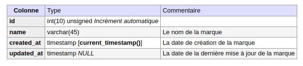
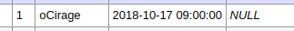
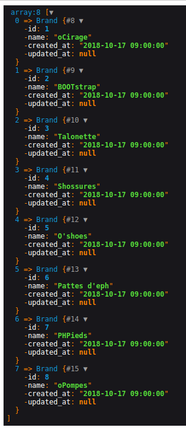

# Model

En MVC (Model View Controller), le model représente la partie de l'application qui gère les données et les interactions avec la base de données.

Pour faire simple, en MVC on a :
- La vue => C'est ce qui s'affiche 
- Le controller => le chef d'orchestre, il communique avec le model et envoie les données à la vue
- Le model => Il communique avec la base de données

## Comment fonctionne les models en MVC sur du PHP ?

C'est très simple : Un model c'est tout simplement une classe PHP qui a le même nom que la table de la bdd qu'il est censé représenter.

Par exemple, si on a une table brand et qui ressemble a ça :

 

 Et bien le model qui va représenter cette table brand ressemblera à ça :

 ```php
 <?php

// Le nom de la classe doit être identique à la table qu'on veut manipuler (ici la table brand)
class Brand
{
    // On définit les propriétés du model
    // Les propriétés du model sont tout simplement des propriétés qui font référence aux champs de la table brand

    /**
     * Le champ id de la table brand
     *
     * @var [int]
     */
    private $id;

    /**
     * Le champ name de la table brand
     *
     * @var [string]
     */
    private $name;

    /**
     * Le champ created_at de la table brand
     *
     * @var [date]
     */
    private $created_at;

    /**
     * Le champ updated_at de la table brand
     *
     * @var [date]
     */
    private $updated_at;


    /**
     * Get the value of id
     */ 
    public function getId()
    {
        return $this->id;
    }

    /**
     * Set the value of id
     *
     * @return  self
     */ 
    public function setId($id)
    {
        $this->id = $id;

        return $this;
    }

    /**
     * Get the value of name
     */ 
    public function getName()
    {
        return $this->name;
    }

    /**
     * Set the value of name
     *
     * @return  self
     */ 
    public function setName($name)
    {
        $this->name = $name;

        return $this;
    }

    /**
     * Get the value of created_at
     */ 
    public function getCreated_at()
    {
        return $this->created_at;
    }

    /**
     * Set the value of created_at
     *
     * @return  self
     */ 
    public function setCreated_at($created_at)
    {
        $this->created_at = $created_at;

        return $this;
    }

    /**
     * Get the value of updated_at
     */ 
    public function getUpdated_at()
    {
        return $this->updated_at;
    }

    /**
     * Set the value of updated_at
     *
     * @return  self
     */ 
    public function setUpdated_at($updated_at)
    {
        $this->updated_at = $updated_at;

        return $this;
    }
}
 ```

Pour chaque champ de la table brand, on va avoir des propriétés qui ont le même nom dans le model Brand.php
Mais pour l'instant ce "model" n'est aucunement lié à la base de données.
### Comment va t-on récupérer des données depuis la bdd avec cette classe ?

Grâce à un modèle de conception qui s'appelle ActiveRecord

## ActiveRecord

ActiveRecord est un modèle de conception (pattern) très couramment utilisé dans le développement d'applications Web (notamment dans des frameworks tres populaire comme Symfony ou Laravel).

#### Mais à quoi sert ActiveRecord ?

ActiveRecord permet de représenter des données de la base de données sous forme d'objets dans le langage de programmation qu'on utilise (ici PHP). Il offre une interface orientée objet pour intéragir avec la base de données, ce qui simplifie le processus de manipulation des données.

Par exemple :
On a cet enregistrement en BDD :

 

Grâce à ActiveRecord, cet enregistrement ressemblera à ça en PHP :

```php
// On a un objet $brand qui est une instance du model Brand
$brand
// Et voilà les valeurs des propriétés de $brand
echo $brand->getId();
// Affiche '1'
echo $brand->getName();
// Affiche 'Ocirage'
```

### Comment mettre ActiveRecord en place ?

On va tout d'abord créer un fichier config.ini dans le dossier app/
Dans ce fichier config.ini, on va avoir les accès pour s'authentifier à la base de données :
```
DB_HOST=localhost 
DB_NAME=nom_bdd
DB_USERNAME=username_bdd
DB_PASSWORD=password_bdd
```

Une fois que c'est fait, on recopier la classe Database.php dans le dossier utils/ (pas besoin d'explorer Database.php pour l'instant, on verra ca plus tard).
On retient juste que pour l'utiliser on fait :
```php
$pdo = Database::getPDO();
```
Et ça suffit pour établir la connexion à la base de données avec PDO.

#### On retourne dans notre model Brand 
Dans le model Brand on va créer une méthode findAll() qui va me permettre de récupérer TOUS les enregistrements de la table brand de ma base de données.

Voilà à quoi ressemble la méthode findAll() :
```php
/**
 * Récupère les données de toutes les marques
 */
public function findAll()
{
    // Ci dessous $sql c'est la requête sql qui va me permettre de récupérer toutes les marques
    $sql = 'SELECT * FROM brand;';

    // Ici Database::getPDO() me retourne l'objet PDO représentant la connexion à la BDD
    $pdo = Database::getPDO();

    // Ici on va executer la requête $sql
    $pdoResult = $pdo->query($sql);
    
    // Ci dessous $brands = un tableau classique en PHP
    // $brands = $pdoResult->fetchAll();
    
    // fetchAll avec l'argument PDO::FETCH_CLASS renvoie un aray qui contient tous mes résultats sous la forme d'objets de la classe spécifiée en 2eme argument (ici Brand => Le model Brand)
    $brands = $pdoResult->fetchAll(PDO::FETCH_CLASS, 'Brand');
    
    // On retourne toutes les marques
    return $brands;
}
```
Et voilà ce qu'on récupère grâce à cette méthode findAll() :

