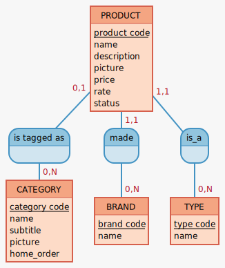

# Modélisation de la base de données oShop

## MCD (Mocodo)

```
PRODUCT: product code, name, description, picture, price, rate, status

is tagged as, 01 PRODUCT, 0N CATEGORY
made, 11 PRODUCT, 0N BRAND
is_a, 11 PRODUCT, 0N TYPE

CATEGORY: category code, name, subtitle, picture, home_order
BRAND: brand code, name
TYPE: type code, name
```


#### Ici on a 4 entités :
- Product
- Category
- Brand
- Type

Ces 4 entités sont liés par ce qu'on appelle des "associations". Une association c'est juste un verbe (conjugué ou non) qui représente cette association entre les 2 entités.

Par exemple : L'entité Product est lié à l'entité Category par l'association "is tagged as" (est rattaché à), car un produit est rattaché à une catégorie tout simplement.


Dans une association entre 2 entités, on a ce qu'on appelle des "cardinalités".
Les cardinalités représentent les valeurs minimum et maximum qu'il peut y avoir dans une assocaition entre 2 entités. 

Par exemple dans le cas de l'association entre product et brand, on a 2 cardinalités : de product à brand et inversement de brand à product.
On sait qu'un produit, selon le MCD, ne peut appartenir qu'à une seule marque au minimum et qu'à une seule marque au maximum, d'ou les cardinalités 1,1 (de product à brand).
On sait qu'inversement, une marque peut avoir au minimum 0 produit et au maximum plusieurs produits, d'ou les cardinalités 0,N (de brand à product).


## MLD

**BRAND** (<ins>brand code</ins>, name)

**CATEGORY** (<ins>category code</ins>, name, subtitle picture, home_order )

**PRODUCT** (<ins>product code</ins>, name, description picture, price, rate, status, #category code, #brand code, #type code )

**TYPE** (<ins>type code</ins>, name)